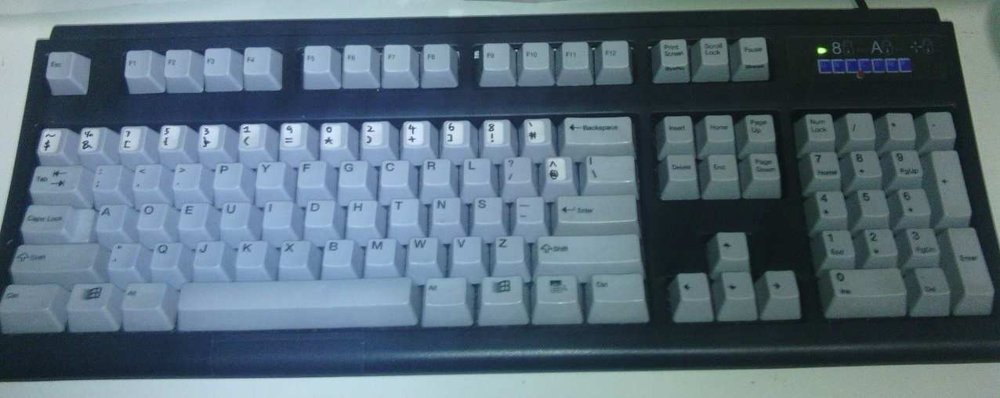
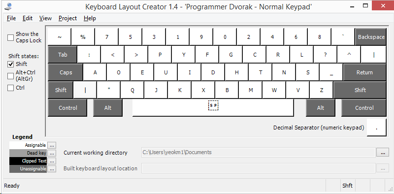
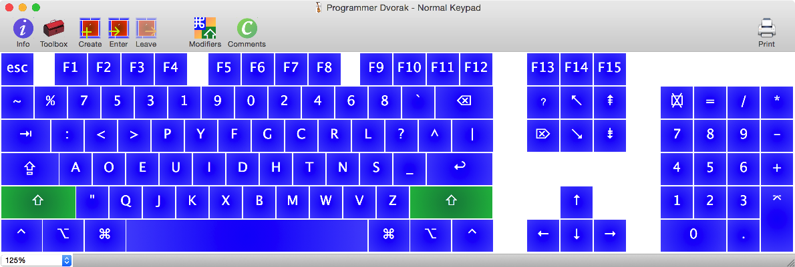

# coders-dvorak-regular-keypad

I like [Roland Kaufmann's Programmer Dvorak](http://www.kaufmann.no/roland/dvorak/) keyboard layout however I dislike the fact that he reverses the direction of the numeric keypad. This is an installable solution that slightly backtracks from his improvements. This repository was originally called "programmer-dvorak-normal-keypad" but due to objections from Roland himself, I have renamed this to "coders-dvorak-regular-keypad". The layout name in the releases folder will be adjusted when time permits.

To get an idea, here is a comparison

Kaufman's original layout with "improved" keypad layout

My normal keypad version

If you prefer my version, continue on.

## How to use?

1) Go to the [Release directory](Release/) section.  
2) Download either the "English Singapore" or "English US" version relevant to your operating system Windows/Mac.  
3) Unzip the file  

### Windows
3) Run `msi` or `setup.exe`  
4) Go to Control Panel -> Language  
5) Select your language -> Option -> Add an input method   
6) Search for `Programmer Dvorak - Normal Keypad` and Add. If the new layout is not visible, you may need to reboot your machine and start from Step 4.

### Mac
3) Copy the `*.bundle` file to `~/Library/Keyboard Layouts` for the current user and `*.keylayout` to `/Library/Keyboard Layouts` for login screen purposes.
4) Go to System Preferences, Keyboard, Input Sources, click "+", select English, select `Programmer Dvorak - Normal Keypad`

### For Login Screen
[For Mac](https://apple.stackexchange.com/questions/44913/make-a-custom-keyboard-layout-the-system-default-even-for-the-login-screen)

[For Windows](https://social.technet.microsoft.com/Forums/windows/en-US/c64ee221-db3c-4058-8d1b-673de613535f/how-to-change-keyboard-layout-for-login-and-password-in-windows-8?forum=w8itprogeneral)

Go to Control Panel:
"Open "region" > then on the "administration" tab > click "copy settings" > then check the box "for home screen & new users"."

## How to modify?

If you need to modify the layout for some reason...

### Windows

1) Install the [Microsoft Keyboard Layout Creator](https://msdn.microsoft.com/en-us/goglobal/bb964665.aspx)  
2) Open the `.klc` file you wish to modify. I can't seem to view the keypad in MKLC though. 

You should see something like this:  

3) Set current working directory  
4) Once you are done, click Project->Build DLL and Setup Package.  
5) Go to your working directory to retrieve the install folder  

### Mac

1) Install [Ukelele](http://software.sil.org/ukelele/)  
2) Open the `.keylayout` file you wist to modify. You may wish to change the keyboard type to view the keypad. View -> Keyboard Type -> Third party.

You should see something like this:  

3) Save as bundle
